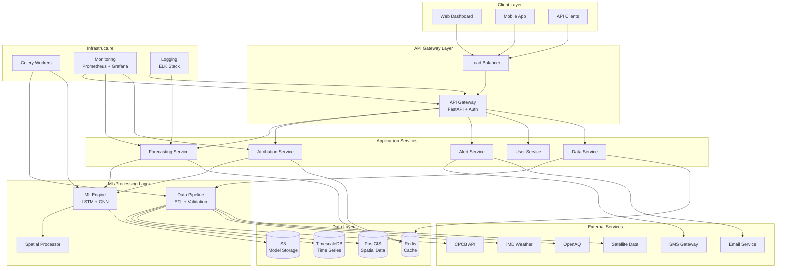

# Design Document

## Overview

This design document outlines the architecture and implementation approach for completing the AQI Predictor project to meet PRD specifications. The design transforms the current Streamlit-only prototype into a production-ready, scalable air quality forecasting platform with advanced ML capabilities, comprehensive data pipeline, and robust infrastructure.

### Design Goals

1. **Production Readiness**: Transform prototype into scalable, reliable system
2. **Microservices Architecture**: Decompose monolithic app into specialized services
3. **Advanced ML Capabilities**: Implement LSTM and Graph Neural Networks for improved accuracy
4. **Comprehensive Data Pipeline**: Integrate multiple data sources with quality validation
5. **User-Centric Features**: Add alerting, authentication, and mobile support
6. **Operational Excellence**: Include monitoring, logging, and automated deployment

### Key Design Principles

- **Separation of Concerns**: Each service handles a specific domain
- **Scalability**: Horizontal scaling capabilities for all components
- **Resilience**: Graceful degradation and fault tolerance
- **Observability**: Comprehensive monitoring and logging
- **Security**: Authentication, authorization, and data protection
- **Performance**: Sub-500ms API responses and real-time updates

## Architecture

### High-Level Architecture



### Service Architecture

#### 1. API Gateway Service
**Technology**: FastAPI + OAuth 2.0 + Rate Limiting

**Responsibilities**:
- Request routing and load balancing
- Authentication and authorization
- Rate limiting and request validation
- API documentation (OpenAPI/Swagger)
- Response caching and compression

**Key Components**:
- Authentication middleware
- Rate limiting middleware
- Request/response logging
- Health check endpoints
- API versioning support

#### 2. Forecasting Service
**Technology**: FastAPI + XGBoost + LSTM + GNN

**Responsibilities**:
- Generate hourly nowcast predictions
- Produce 24-hour forecasts with confidence intervals
- Manage ensemble model predictions
- Handle spatial grid interpolation
- Provide model performance metrics

**Key Components**:
- Model inference engine
- Ensemble prediction logic
- Confidence interval calculation
- Spatial interpolation algorithms
- Model version management

#### 3. Attribution Service
**Technology**: FastAPI + SHAP + Custom Attribution Models

**Responsibilities**:
- Calculate source attribution percentages
- Generate SHAP-based explanations
- Support "what-if" scenario analysis
- Provide policy simulation tools
- Quantify attribution uncertainty

**Key Components**:
- Source decomposition models
- SHAP explanation engine
- Scenario simulation framework
- Policy impact calculator
- Uncertainty quantification

#### 4. Data Service
**Technology**: FastAPI + SQLAlchemy + TimescaleDB

**Responsibilities**:
- Manage data ingestion from multiple sources
- Provide data access APIs
- Handle data quality validation
- Manage historical data queries
- Support spatial data operations

**Key Components**:
- Data ingestion controllers
- Quality validation engine
- Historical data APIs
- Spatial query handlers
- Data export functionality

#### 5. Alert Service
**Technology**: FastAPI + Celery + SMS/Email APIs

**Responsibilities**:
- Manage user alert subscriptions
- Send notifications via multiple channels
- Handle alert threshold monitoring
- Provide notification history
- Support unsubscribe functionality

**Key Components**:
- Subscription management
- Notification dispatcher
- Threshold monitoring
- Template engine
- Delivery tracking

#### 6. User Service
**Technology**: FastAPI + OAuth 2.0 + JWT

**Responsibilities**:
- User registration and authentication
- Profile and preference management
- Role-based access control
- API key management
- User analytics

**Key Components**:
- Authentication handlers
- Profile management
- Permission system
- API key generation
- User activity tracking

## Components and Interfaces

### Data Models

#### Air Quality Measurement
```python
class AirQualityMeasurement:
    id: UUID
    station_id: str
    timestamp: datetime
    parameter: str  # pm25, pm10, o3, no2, so2, co
    value: float
    unit: str
    quality_flag: str
    source: str
    location: Point  # PostGIS geometry
    created_at: datetime
```

#### Weather Data
```python
class WeatherData:
    id: UUID
    location: Point
    timestamp: datetime
    temperature: float
    humidity: float
    wind_speed: float
    wind_direction: float
    pressure: float
    precipitation: float
    visibility: float
    source: str
    created_at: datetime
```

#### Prediction
```python
class Prediction:
    id: UUID
    location: Point
    timestamp: datetime
    forecast_hour: int  # 1-24
    parameter: str
    predicted_value: float
    confidence_lower: float
    confidence_upper: float
    model_version: str
    aqi_value: int
    aqi_category: str
    created_at: datetime
```

#### Source Attribution
```python
class SourceAttribution:
    id: UUID
    location: Point
    timestamp: datetime
    vehicular_percent: float
    industrial_percent: float
    biomass_percent: float
    background_percent: float
    confidence_score: float
    model_version: str
    created_at: datetime
```

#### User Alert Subscription
```python
class AlertSubscription:
    id: UUID
    user_id: UUID
    location: Point
    threshold_value: int
    notification_channels: List[str]  # email, sms, push
    is_active: bool
    created_at: datetime
    updated_at: datetime
```

### API Interfaces

#### Forecasting API
```python
# GET /api/v1/forecast/current/{location}
class CurrentForecastResponse:
    location: LocationInfo
    timestamp: datetime
    aqi: int
    category: str
    pollutants: Dict[str, PollutantReading]
    weather: WeatherInfo
    source_attribution: SourceAttributionInfo

# GET /api/v1/forecast/24h/{location}
class HourlyForecastResponse:
    location: LocationInfo
    forecasts: List[HourlyForecast]
    metadata: ForecastMetadata

# POST /api/v1/forecast/spatial
class SpatialForecastRequest:
    bounds: BoundingBox
    resolution: float  # km
    timestamp: datetime

class SpatialForecastResponse:
    grid_predictions: List[GridPrediction]
    metadata: SpatialMetadata
```

#### Attribution API
```python
# GET /api/v1/attribution/{location}
class AttributionResponse:
    location: LocationInfo
    timestamp: datetime
    sources: Dict[str, SourceContribution]
    explanations: SHAPExplanation
    confidence: float

# POST /api/v1/attribution/scenario
class ScenarioRequest:
    location: LocationInfo
    interventions: List[PolicyIntervention]

class ScenarioResponse:
    baseline_aqi: int
    predicted_aqi: int
    impact_percentage: float
    source_changes: Dict[str, float]
```

#### Alert API
```python
# POST /api/v1/alerts/subscribe
class AlertSubscriptionRequest:
    location: LocationInfo
    threshold: int
    channels: List[str]

# GET /api/v1/alerts/history
class AlertHistoryResponse:
    alerts: List[AlertRecord]
    pagination: PaginationInfo
```

### ML Model Interfaces

#### LSTM Time Series Model
```python
class LSTMForecaster:
    def __init__(self, sequence_length: int = 24, features: int = 20):
        self.model = self._build_lstm_model()
        self.scaler = StandardScaler()
        self.sequence_length = sequence_length
    
    def train(self, X: np.ndarray, y: np.ndarray) -> TrainingMetrics:
        """Train LSTM model on time series data"""
        
    def predict(self, X: np.ndarray) -> PredictionResult:
        """Generate predictions with uncertainty"""
        
    def predict_sequence(self, initial_state: np.ndarray, 
                        hours: int) -> List[PredictionResult]:
        """Generate multi-step ahead predictions"""
```

#### Graph Neural Network
```python
class SpatialGNN:
    def __init__(self, num_stations: int, hidden_dim: int = 64):
        self.graph = self._build_station_graph()
        self.model = self._build_gnn_model()
    
    def build_adjacency_matrix(self, stations: List[Station]) -> np.ndarray:
        """Build spatial adjacency matrix based on distance and correlation"""
        
    def predict_spatial(self, station_data: Dict[str, np.ndarray]) -> Dict[str, float]:
        """Predict values for all stations using spatial relationships"""
        
    def interpolate_grid(self, station_predictions: Dict[str, float], 
                        grid_points: List[Point]) -> List[float]:
        """Interpolate predictions to regular grid"""
```

#### Ensemble Model
```python
class EnsembleForecaster:
    def __init__(self):
        self.models = {
            'xgboost': XGBoostForecaster(),
            'lstm': LSTMForecaster(),
            'gnn': SpatialGNN()
        }
        self.weights = {'xgboost': 0.4, 'lstm': 0.4, 'gnn': 0.2}
    
    def predict(self, features: np.ndarray) -> EnsemblePrediction:
        """Generate weighted ensemble predictions"""
        
    def update_weights(self, validation_scores: Dict[str, float]):
        """Update ensemble weights based on recent performance"""
```

## Data Models

### Database Schema Design

#### TimescaleDB Hypertables
```sql
-- Air quality measurements hypertable
CREATE TABLE air_quality_measurements (
    time TIMESTAMPTZ NOT NULL,
    station_id TEXT NOT NULL,
    parameter TEXT NOT NULL,
    value DOUBLE PRECISION,
    unit TEXT,
    quality_flag TEXT,
    source TEXT,
    location GEOMETRY(POINT, 4326),
    created_at TIMESTAMPTZ DEFAULT NOW()
);

SELECT create_hypertable('air_quality_measurements', 'time');
CREATE INDEX ON air_quality_measurements (station_id, time DESC);
CREATE INDEX ON air_quality_measurements USING GIST (location);

-- Weather data hypertable
CREATE TABLE weather_data (
    time TIMESTAMPTZ NOT NULL,
    location GEOMETRY(POINT, 4326) NOT NULL,
    temperature DOUBLE PRECISION,
    humidity DOUBLE PRECISION,
    wind_speed DOUBLE PRECISION,
    wind_direction DOUBLE PRECISION,
    pressure DOUBLE PRECISION,
    precipitation DOUBLE PRECISION,
    source TEXT,
    created_at TIMESTAMPTZ DEFAULT NOW()
);

SELECT create_hypertable('weather_data', 'time');
CREATE INDEX ON weather_data USING GIST (location);

-- Predictions hypertable
CREATE TABLE predictions (
    time TIMESTAMPTZ NOT NULL,
    location GEOMETRY(POINT, 4326) NOT NULL,
    forecast_hour INTEGER NOT NULL,
    parameter TEXT NOT NULL,
    predicted_value DOUBLE PRECISION,
    confidence_lower DOUBLE PRECISION,
    confidence_upper DOUBLE PRECISION,
    model_version TEXT,
    aqi_value INTEGER,
    aqi_category TEXT,
    created_at TIMESTAMPTZ DEFAULT NOW()
);

SELECT create_hypertable('predictions', 'time');
CREATE INDEX ON predictions (forecast_hour, time DESC);
CREATE INDEX ON predictions USING GIST (location);
```

#### Regular PostgreSQL Tables
```sql
-- Monitoring stations
CREATE TABLE monitoring_stations (
    id UUID PRIMARY KEY DEFAULT gen_random_uuid(),
    station_id TEXT UNIQUE NOT NULL,
    name TEXT NOT NULL,
    location GEOMETRY(POINT, 4326) NOT NULL,
    city TEXT,
    state TEXT,
    country TEXT,
    elevation DOUBLE PRECISION,
    station_type TEXT,
    parameters TEXT[],
    is_active BOOLEAN DEFAULT TRUE,
    created_at TIMESTAMPTZ DEFAULT NOW()
);

CREATE INDEX ON monitoring_stations USING GIST (location);

-- Users and authentication
CREATE TABLE users (
    id UUID PRIMARY KEY DEFAULT gen_random_uuid(),
    email TEXT UNIQUE NOT NULL,
    password_hash TEXT,
    full_name TEXT,
    is_active BOOLEAN DEFAULT TRUE,
    is_verified BOOLEAN DEFAULT FALSE,
    role TEXT DEFAULT 'user',
    created_at TIMESTAMPTZ DEFAULT NOW(),
    updated_at TIMESTAMPTZ DEFAULT NOW()
);

-- Alert subscriptions
CREATE TABLE alert_subscriptions (
    id UUID PRIMARY KEY DEFAULT gen_random_uuid(),
    user_id UUID REFERENCES users(id) ON DELETE CASCADE,
    location GEOMETRY(POINT, 4326) NOT NULL,
    location_name TEXT,
    threshold_value INTEGER NOT NULL,
    notification_channels TEXT[] NOT NULL,
    is_active BOOLEAN DEFAULT TRUE,
    created_at TIMESTAMPTZ DEFAULT NOW(),
    updated_at TIMESTAMPTZ DEFAULT NOW()
);

CREATE INDEX ON alert_subscriptions (user_id);
CREATE INDEX ON alert_subscriptions USING GIST (location);
```

### Data Retention Policies
```sql
-- Retain raw measurements for 2 years
SELECT add_retention_policy('air_quality_measurements', INTERVAL '2 years');

-- Retain weather data for 3 years
SELECT add_retention_policy('weather_data', INTERVAL '3 years');

-- Retain predictions for 1 year
SELECT add_retention_policy('predictions', INTERVAL '1 year');

-- Create continuous aggregates for common queries
CREATE MATERIALIZED VIEW hourly_aqi_summary
WITH (timescaledb.continuous) AS
SELECT 
    time_bucket('1 hour', time) AS hour,
    station_id,
    parameter,
    AVG(value) as avg_value,
    MAX(value) as max_value,
    MIN(value) as min_value,
    COUNT(*) as measurement_count
FROM air_quality_measurements
GROUP BY hour, station_id, parameter;

SELECT add_continuous_aggregate_policy('hourly_aqi_summary',
    start_offset => INTERVAL '1 day',
    end_offset => INTERVAL '1 hour',
    schedule_interval => INTERVAL '1 hour');
```

### Spatial Data Optimization
```sql
-- Create spatial partitions for major cities
CREATE TABLE air_quality_delhi PARTITION OF air_quality_measurements
FOR VALUES FROM ('2024-01-01') TO ('2025-01-01')
WHERE ST_DWithin(location, ST_GeomFromText('POINT(77.2090 28.6139)', 4326), 0.5);

-- Spatial indexes for common queries
CREATE INDEX idx_aq_spatial_temporal ON air_quality_measurements 
USING GIST (location, time);

-- Optimize for common spatial queries
CREATE INDEX idx_predictions_grid ON predictions 
USING GIST (ST_SnapToGrid(location, 0.01));
```

Now I need to use the prework tool to analyze the acceptance criteria before writing the Correctness Properties section:

<function_calls>
<invoke name="prework">
<parameter name="featureName">aqi-predictor-completion

## Correctness Properties

*A property is a characteristic or behavior that should hold true across all valid executions of a system—essentially, a formal statement about what the system should do. Properties serve as the bridge between human-readable specifications and machine-verifiable correctness guarantees.*

### Property Reflection

After analyzing the acceptance criteria, I identified several properties that can be consolidated to eliminate redundancy:

- **Database and API properties** can be combined where they test similar functionality
- **Performance properties** (response times, uptime) are operational metrics better suited for monitoring
- **Compliance properties** (GDPR, security) are process-oriented rather than code-testable
- **ML accuracy properties** should be consolidated into comprehensive model validation

The following properties focus on core functional correctness that can be validated through automated testing:

### Core System Properties

#### Property 1: Data Persistence Round Trip
*For any* air quality measurement or weather data, storing it in the database and then retrieving it should produce equivalent data with all essential fields preserved
**Validates: Requirements 2.3, 2.4**

#### Property 2: API Response Format Consistency
*For any* valid API request, the response should be valid JSON with proper HTTP status codes and include all required fields as specified in the API schema
**Validates: Requirements 3.9**

#### Property 3: Rate Limiting Enforcement
*For any* user making API requests, after exceeding 1000 requests per hour, subsequent requests should be rejected with appropriate rate limiting status codes
**Validates: Requirements 3.6**

#### Property 4: Multi-Location API Support
*For any* valid location (coordinates or city name), the API should return current AQI data and 24-hour forecasts in the expected format
**Validates: Requirements 3.2, 3.3**

### ML Model Properties

#### Property 5: LSTM Model Accuracy Bounds
*For any* validation dataset, the LSTM model's RMSE for 1-hour PM2.5 predictions should be less than 20 μg/m³ and 24-hour predictions should be less than 35 μg/m³
**Validates: Requirements 4.4, 4.5**

#### Property 6: Confidence Interval Calibration
*For any* prediction with 80% confidence intervals, approximately 80% of actual values should fall within the predicted bounds when evaluated on validation data
**Validates: Requirements 4.6**

#### Property 7: Source Attribution Completeness
*For any* pollution measurement, the source attribution percentages (vehicular, industrial, biomass, background) should sum to 100% ± 1%
**Validates: Requirements 5.1**

#### Property 8: Scenario Analysis Consistency
*For any* policy intervention scenario, the predicted AQI change should be consistent with the magnitude and type of intervention applied
**Validates: Requirements 5.6**

### Data Pipeline Properties

#### Property 9: Data Quality Validation
*For any* incoming data point, outliers beyond 3 standard deviations from historical norms should be flagged and handled appropriately
**Validates: Requirements 6.5**

#### Property 10: Job Retry Exponential Backoff
*For any* failed background job, retry attempts should follow exponential backoff pattern with increasing delays between attempts
**Validates: Requirements 8.5**

### Alerting Properties

#### Property 11: Alert Threshold Triggering
*For any* location with AQI exceeding the unhealthy threshold (>150), subscribed users should receive alerts within 5 minutes
**Validates: Requirements 9.1**

#### Property 12: Alert Rate Limiting
*For any* user, no more than one alert per hour should be sent for the same location and threshold to prevent notification spam
**Validates: Requirements 9.8**

### Spatial Properties

#### Property 13: Spatial Grid Resolution
*For any* spatial prediction request, the generated grid should have exactly 1km × 1km resolution with predictions for all requested grid points
**Validates: Requirements 10.1**

#### Property 14: Hourly Spatial Updates
*For any* spatial grid, predictions should be updated every hour with timestamps reflecting the update time
**Validates: Requirements 10.4**

### Multi-City Properties

#### Property 15: Multi-City Support Coverage
*For any* of the supported cities (minimum 10), the system should provide current AQI data, forecasts, and source attribution
**Validates: Requirements 12.1**

## Error Handling

### Error Classification

#### 1. Data Source Failures
**Scenarios**:
- CPCB API unavailable
- Weather service timeout
- Satellite data processing failure
- Database connection loss

**Handling Strategy**:
- Graceful degradation to available data sources
- Cached data fallback with staleness indicators
- User notification of reduced accuracy
- Automatic retry with exponential backoff
- Circuit breaker pattern for failing services

#### 2. Model Prediction Failures
**Scenarios**:
- Model inference timeout
- Invalid input data format
- Model file corruption
- Insufficient historical data

**Handling Strategy**:
- Fallback to simpler rule-based predictions
- Ensemble model degradation (use available models)
- Uncertainty indication in responses
- Model health monitoring and alerts
- Automatic model reloading

#### 3. API and Service Errors
**Scenarios**:
- Invalid request parameters
- Authentication failures
- Rate limit exceeded
- Service unavailable

**Handling Strategy**:
- Comprehensive input validation
- Clear error messages with correction guidance
- Proper HTTP status codes
- Request retry recommendations
- Service health status endpoints

#### 4. Database and Storage Errors
**Scenarios**:
- Database connection timeout
- Disk space exhaustion
- Data corruption
- Query performance degradation

**Handling Strategy**:
- Connection pooling and retry logic
- Read replica fallback for queries
- Data integrity checks and repair
- Query optimization and caching
- Storage monitoring and alerts

### Error Response Format
```json
{
  "error": {
    "code": "DATA_SOURCE_UNAVAILABLE",
    "message": "Weather data temporarily unavailable",
    "details": "OpenWeatherMap API timeout",
    "timestamp": "2024-01-15T10:30:00Z",
    "request_id": "req_123456789",
    "fallback_used": true,
    "retry_after": 300
  }
}
```

### Circuit Breaker Implementation
```python
class CircuitBreaker:
    def __init__(self, failure_threshold: int = 5, timeout: int = 60):
        self.failure_threshold = failure_threshold
        self.timeout = timeout
        self.failure_count = 0
        self.last_failure_time = None
        self.state = "CLOSED"  # CLOSED, OPEN, HALF_OPEN
    
    def call(self, func, *args, **kwargs):
        if self.state == "OPEN":
            if time.time() - self.last_failure_time > self.timeout:
                self.state = "HALF_OPEN"
            else:
                raise CircuitBreakerOpenError()
        
        try:
            result = func(*args, **kwargs)
            if self.state == "HALF_OPEN":
                self.state = "CLOSED"
                self.failure_count = 0
            return result
        except Exception as e:
            self.failure_count += 1
            self.last_failure_time = time.time()
            
            if self.failure_count >= self.failure_threshold:
                self.state = "OPEN"
            
            raise e
```

## Testing Strategy

### Dual Testing Approach

The testing strategy employs both unit testing and property-based testing as complementary approaches:

- **Unit tests**: Verify specific examples, edge cases, and error conditions
- **Property tests**: Verify universal properties across all inputs
- Both approaches are necessary for comprehensive coverage

### Unit Testing Strategy

**Focus Areas**:
- Specific examples that demonstrate correct behavior
- Integration points between services
- Edge cases and error conditions
- API endpoint functionality
- Database operations

**Testing Framework**: pytest with fixtures for database and service mocking

**Example Unit Tests**:
```python
def test_aqi_calculation_specific_values():
    """Test AQI calculation for known PM2.5 values"""
    assert calculate_aqi({"pm25": 35.5}) == (101, "pm25", "unhealthy_sensitive")
    assert calculate_aqi({"pm25": 12.0}) == (50, "pm25", "good")

def test_api_authentication_failure():
    """Test API returns 401 for invalid credentials"""
    response = client.get("/api/v1/forecast/current/delhi", 
                         headers={"Authorization": "Bearer invalid"})
    assert response.status_code == 401

def test_database_connection_retry():
    """Test database connection retry logic"""
    with mock.patch('psycopg2.connect', side_effect=ConnectionError):
        with pytest.raises(DatabaseUnavailableError):
            db_client.get_current_data("delhi")
```

### Property-Based Testing Strategy

**Configuration**:
- Minimum 100 iterations per property test
- Each property test references its design document property
- Tag format: **Feature: aqi-predictor-completion, Property {number}: {property_text}**

**Testing Framework**: Hypothesis for Python property-based testing

**Property Test Examples**:
```python
from hypothesis import given, strategies as st

@given(st.floats(min_value=0, max_value=1000))
def test_data_persistence_round_trip(pm25_value):
    """Feature: aqi-predictor-completion, Property 1: Data Persistence Round Trip"""
    # Store measurement
    measurement = AirQualityMeasurement(
        station_id="test_station",
        parameter="pm25",
        value=pm25_value,
        timestamp=datetime.now()
    )
    stored_id = db.store_measurement(measurement)
    
    # Retrieve measurement
    retrieved = db.get_measurement(stored_id)
    
    # Verify equivalence
    assert retrieved.value == measurement.value
    assert retrieved.parameter == measurement.parameter
    assert retrieved.station_id == measurement.station_id

@given(st.integers(min_value=0, max_value=2000))
def test_rate_limiting_enforcement(request_count):
    """Feature: aqi-predictor-completion, Property 3: Rate Limiting Enforcement"""
    user_id = "test_user"
    
    # Make requests up to limit
    responses = []
    for i in range(min(request_count, 1001)):
        response = api_client.get(f"/api/v1/forecast/current/delhi",
                                headers={"X-User-ID": user_id})
        responses.append(response.status_code)
    
    # Verify rate limiting behavior
    if request_count <= 1000:
        assert all(status == 200 for status in responses)
    else:
        # First 1000 should succeed, rest should be rate limited
        assert all(status == 200 for status in responses[:1000])
        assert responses[1000] == 429  # Rate limited

@given(st.lists(st.floats(min_value=0, max_value=100), min_size=4, max_size=4))
def test_source_attribution_completeness(source_percentages):
    """Feature: aqi-predictor-completion, Property 7: Source Attribution Completeness"""
    # Normalize to ensure they sum to 100%
    total = sum(source_percentages)
    if total > 0:
        normalized = [p / total * 100 for p in source_percentages]
    else:
        normalized = [25.0, 25.0, 25.0, 25.0]
    
    attribution = SourceAttribution(
        vehicular_percent=normalized[0],
        industrial_percent=normalized[1],
        biomass_percent=normalized[2],
        background_percent=normalized[3]
    )
    
    total_attribution = (attribution.vehicular_percent + 
                        attribution.industrial_percent + 
                        attribution.biomass_percent + 
                        attribution.background_percent)
    
    # Should sum to 100% within 1% tolerance
    assert abs(total_attribution - 100.0) <= 1.0
```

### Integration Testing

**Service Integration Tests**:
- End-to-end API workflows
- Database integration with real TimescaleDB
- External API integration (with mocking)
- Message queue integration with Celery

**Performance Testing**:
- Load testing with 1000 concurrent users
- API response time validation (< 500ms p95)
- Database query performance testing
- Memory and CPU usage profiling

**Security Testing**:
- Authentication and authorization testing
- Input validation and SQL injection prevention
- Rate limiting effectiveness
- HTTPS enforcement

### Continuous Integration

**Test Pipeline**:
1. **Unit Tests**: Fast feedback on code changes
2. **Property Tests**: Comprehensive correctness validation
3. **Integration Tests**: Service interaction validation
4. **Performance Tests**: Response time and throughput validation
5. **Security Tests**: Vulnerability scanning

**Quality Gates**:
- 80%+ code coverage requirement
- All property tests must pass
- Performance benchmarks must be met
- Security scans must pass
- Documentation must be updated

**Test Environment Management**:
- Dockerized test environments
- Database fixtures and test data
- Mock external services
- Parallel test execution
- Test result reporting and analysis