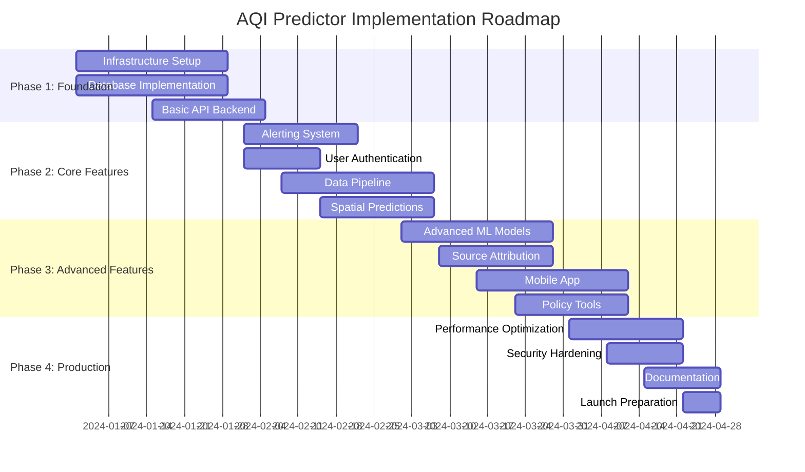

# AQI Predictor: Implementation Roadmap

## Executive Summary

This roadmap provides a structured approach to complete the AQI Predictor project according to PRD specifications. The plan is organized into four phases over 16-20 weeks, prioritizing critical infrastructure and core functionality before advanced features.

**Current Status: 35% Complete**
**Target: 100% PRD Compliance**
**Timeline: 16-20 weeks**
**Team Size: 4-6 developers**

## Roadmap Overview

## Phase 1: Foundation (Weeks 1-4)
**Goal: Enable production deployment and data persistence**

### Week 1-2: Infrastructure Setup
**Priority: Critical**

#### 1.1 Docker Containerization
- [ ] Create Dockerfile for Streamlit application
- [ ] Create Docker Compose for local development
- [ ] Set up multi-stage builds for production
- [ ] Configure environment variable management
- [ ] Test container deployment locally

**Deliverables:**
- `Dockerfile` with optimized Python environment
- `docker-compose.yml` for full stack
- `.env.example` with all required variables
- Container deployment documentation

**Acceptance Criteria:**
- Application runs in Docker container
- All dependencies properly containerized
- Environment variables properly configured
- Local development environment functional

#### 1.2 Database Implementation
- [ ] Set up TimescaleDB with PostGIS extension
- [ ] Design database schema for time-series data
- [ ] Create migration scripts for schema setup
- [ ] Implement database connection pooling
- [ ] Set up backup and recovery procedures

**Deliverables:**
- Database schema SQL files
- Migration scripts
- Connection management utilities
- Backup/restore documentation

**Acceptance Criteria:**
- TimescaleDB operational with PostGIS
- Schema supports all required data types
- Connection pooling configured
- Backup procedures tested

### Week 2-3: Basic API Backend
**Priority: Critical**

#### 1.3 FastAPI Service Implementation
- [ ] Create FastAPI application structure
- [ ] Implement basic CRUD operations
- [ ] Add database integration with SQLAlchemy
- [ ] Create API endpoints for current AQI data
- [ ] Implement basic error handling and validation

**Deliverables:**
- FastAPI application with core endpoints
- Database models and ORM setup
- API documentation (auto-generated)
- Basic error handling middleware

**Acceptance Criteria:**
- FastAPI service runs independently
- Database operations functional
- API endpoints return proper JSON responses
- OpenAPI documentation accessible

#### 1.4 Data Persistence Layer
- [ ] Implement data models for air quality measurements
- [ ] Create weather data storage models
- [ ] Add prediction storage capabilities
- [ ] Implement data retention policies
- [ ] Set up automated data cleanup

**Deliverables:**
- SQLAlchemy models for all data types
- Data access layer (DAL) implementation
- Retention policy configuration
- Data cleanup scripts

**Acceptance Criteria:**
- All data types properly stored
- Historical data retrievable
- Retention policies functional
- Data integrity maintained

### Week 3-4: Integration and Testing
**Priority: High**

#### 1.5 Service Integration
- [ ] Connect Streamlit app to FastAPI backend
- [ ] Implement API client in Streamlit
- [ ] Add database connectivity to existing features
- [ ] Test end-to-end data flow
- [ ] Set up basic monitoring and logging

**Deliverables:**
- Integrated application stack
- API client library
- Monitoring dashboard
- Integration test suite

**Acceptance Criteria:**
- Streamlit app uses API backend
- Data persists between sessions
- Basic monitoring operational
- Integration tests pass

## Phase 2: Core Features (Weeks 5-8)
**Goal: Implement essential user-facing features**

### Week 5-6: Alerting System
**Priority: Critical**

#### 2.1 Notification Infrastructure
- [ ] Implement email notification service
- [ ] Set up SMS gateway integration
- [ ] Create browser notification system
- [ ] Build alert subscription management
- [ ] Add alert template system

**Deliverables:**
- Email service with HTML templates
- SMS integration with rate limiting
- Browser notification API
- Subscription management UI
- Alert template engine

**Acceptance Criteria:**
- Users can subscribe to alerts
- Notifications sent when thresholds exceeded
- Multiple notification channels functional
- Unsubscribe functionality working

#### 2.2 User Management System
- [ ] Implement user registration and login
- [ ] Add OAuth 2.0 authentication
- [ ] Create user preference management
- [ ] Implement role-based access control
- [ ] Add user profile management

**Deliverables:**
- Authentication service
- User management API
- Profile management UI
- Role-based permissions
- OAuth integration

**Acceptance Criteria:**
- Users can register and login
- Preferences saved and applied
- Admin functions protected
- OAuth providers working

### Week 6-7: Enhanced Data Pipeline
**Priority: High**

#### 2.3 Additional Data Sources
- [ ] Integrate CPCB API for official data
- [ ] Add IMD weather data integration
- [ ] Implement Google Maps traffic API
- [ ] Set up satellite data processing
- [ ] Create data quality validation

**Deliverables:**
- CPCB data ingestion service
- IMD weather integration
- Traffic data processor
- Satellite data pipeline
- Data quality monitoring

**Acceptance Criteria:**
- Multiple data sources integrated
- Data quality issues detected
- Automated data ingestion working
- Data validation rules applied

#### 2.4 Caching and Performance
- [ ] Implement Redis caching layer
- [ ] Add API response caching
- [ ] Optimize database queries
- [ ] Implement connection pooling
- [ ] Add performance monitoring

**Deliverables:**
- Redis cache implementation
- Query optimization
- Performance monitoring dashboard
- Caching strategy documentation

**Acceptance Criteria:**
- API response times < 500ms
- Database queries optimized
- Cache hit rates > 80%
- Performance metrics tracked

### Week 7-8: Spatial Predictions
**Priority: High**

#### 2.5 Spatial Grid Implementation
- [ ] Implement 1km grid generation
- [ ] Add spatial interpolation algorithms
- [ ] Create grid-based prediction models
- [ ] Implement spatial data storage
- [ ] Add map visualization for grids

**Deliverables:**
- Spatial grid generation system
- Interpolation algorithms
- Grid prediction models
- Spatial database schema
- Grid visualization components

**Acceptance Criteria:**
- 1km resolution predictions generated
- Spatial interpolation functional
- Grid data stored efficiently
- Map displays grid predictions

## Phase 3: Advanced Features (Weeks 9-12)
**Goal: Implement advanced ML and user features**

### Week 9-10: Advanced ML Models
**Priority: High**

#### 3.1 LSTM Implementation
- [ ] Implement LSTM time-series models
- [ ] Add ensemble prediction capabilities
- [ ] Create model versioning system
- [ ] Implement automated retraining
- [ ] Add model performance monitoring

**Deliverables:**
- LSTM model implementation
- Ensemble prediction system
- MLflow integration
- Automated training pipeline
- Model monitoring dashboard

**Acceptance Criteria:**
- LSTM models achieve accuracy targets
- Ensemble predictions functional
- Model versions tracked
- Automated retraining working

#### 3.2 Graph Neural Networks
- [ ] Implement GNN for spatial predictions
- [ ] Create spatial relationship graphs
- [ ] Add graph-based feature engineering
- [ ] Integrate GNN with existing models
- [ ] Validate spatial prediction accuracy

**Deliverables:**
- GNN model implementation
- Spatial graph construction
- Graph feature engineering
- Model integration system
- Spatial validation framework

**Acceptance Criteria:**
- GNN models operational
- Spatial relationships captured
- Integration with ensemble working
- Spatial accuracy improved

### Week 10-11: Enhanced Source Attribution
**Priority: Medium**

#### 3.3 Advanced Attribution Models
- [ ] Implement SHAP-based explanations
- [ ] Create source-specific models
- [ ] Add "what-if" scenario analysis
- [ ] Implement policy simulation tools
- [ ] Add attribution uncertainty quantification

**Deliverables:**
- SHAP integration
- Source attribution models
- Scenario analysis engine
- Policy simulation tools
- Uncertainty quantification

**Acceptance Criteria:**
- SHAP explanations generated
- Source attribution accurate
- Scenario analysis functional
- Policy tools operational

### Week 11-12: Mobile Application
**Priority: Medium**

#### 3.4 Mobile App Development
- [ ] Create React Native mobile app
- [ ] Implement push notifications
- [ ] Add location-based features
- [ ] Create offline mode capabilities
- [ ] Implement app store deployment

**Deliverables:**
- React Native mobile application
- Push notification service
- Location services integration
- Offline data caching
- App store packages

**Acceptance Criteria:**
- Mobile app functional on iOS/Android
- Push notifications working
- Location detection accurate
- Offline mode operational

## Phase 4: Production Optimization (Weeks 13-16)
**Goal: Production readiness and launch preparation**

### Week 13-14: Performance Optimization
**Priority: Medium**

#### 4.1 System Optimization
- [ ] Implement load balancing
- [ ] Add CDN for static assets
- [ ] Optimize database performance
- [ ] Implement auto-scaling
- [ ] Add comprehensive monitoring

**Deliverables:**
- Load balancer configuration
- CDN setup
- Database optimization
- Auto-scaling policies
- Monitoring stack

**Acceptance Criteria:**
- System handles 1000 concurrent users
- Load balancing functional
- Auto-scaling working
- Comprehensive monitoring active

#### 4.2 Security Hardening
- [ ] Implement security best practices
- [ ] Add input validation and sanitization
- [ ] Set up SSL/TLS certificates
- [ ] Implement rate limiting
- [ ] Add security monitoring

**Deliverables:**
- Security configuration
- Input validation framework
- SSL certificate setup
- Rate limiting implementation
- Security monitoring tools

**Acceptance Criteria:**
- Security vulnerabilities addressed
- SSL/TLS properly configured
- Rate limiting functional
- Security monitoring active

### Week 15-16: Launch Preparation
**Priority: Low**

#### 4.3 Documentation and Training
- [ ] Create comprehensive documentation
- [ ] Develop user training materials
- [ ] Create API documentation
- [ ] Write deployment guides
- [ ] Prepare launch materials

**Deliverables:**
- Complete documentation set
- User training materials
- API documentation
- Deployment guides
- Launch preparation checklist

**Acceptance Criteria:**
- Documentation complete and accurate
- Training materials ready
- API docs comprehensive
- Deployment procedures tested

#### 4.4 Launch Activities
- [ ] Conduct final testing
- [ ] Prepare production deployment
- [ ] Set up monitoring and alerting
- [ ] Create launch communication plan
- [ ] Execute soft launch

**Deliverables:**
- Production deployment
- Monitoring setup
- Launch communication
- Soft launch execution
- Post-launch support plan

**Acceptance Criteria:**
- Production system operational
- Monitoring and alerting active
- Launch communication executed
- Initial users onboarded

## Resource Requirements

### Team Composition
- **Tech Lead/Architect** (1): Overall system design and coordination
- **Backend Developers** (2): API, database, ML pipeline development
- **Frontend Developer** (1): Dashboard and mobile app development
- **DevOps Engineer** (1): Infrastructure, deployment, monitoring
- **Data Scientist** (1): ML models, validation, optimization

### Infrastructure Requirements
- **Development Environment**: Docker, local databases
- **Staging Environment**: Cloud VM, managed databases
- **Production Environment**: Kubernetes cluster, managed services
- **Monitoring**: APM tools, log aggregation, metrics collection
- **Security**: SSL certificates, security scanning tools

### External Dependencies
- **Data Sources**: CPCB API access, IMD data, satellite data
- **Third-party Services**: SMS gateway, email service, OAuth providers
- **Cloud Services**: Database hosting, compute resources, storage
- **Development Tools**: CI/CD pipeline, code repositories, project management

## Risk Mitigation

### Technical Risks
1. **Data Source Availability**: Implement fallback data sources and graceful degradation
2. **Model Accuracy**: Continuous validation and ensemble approaches
3. **Performance Issues**: Load testing and optimization throughout development
4. **Integration Complexity**: Incremental integration and comprehensive testing

### Timeline Risks
1. **Scope Creep**: Strict phase boundaries and change control
2. **Resource Constraints**: Flexible team scaling and priority management
3. **External Dependencies**: Early engagement and backup plans
4. **Technical Debt**: Regular refactoring and code quality gates

### Business Risks
1. **User Adoption**: Beta testing and user feedback integration
2. **Regulatory Compliance**: Early legal review and compliance framework
3. **Competition**: Focus on unique value proposition and rapid iteration
4. **Funding**: Phased approach allows for incremental funding decisions

## Success Metrics

### Phase 1 Success Criteria
- [ ] Application runs in production environment
- [ ] Data persists between sessions
- [ ] Basic API endpoints functional
- [ ] Database operations working

### Phase 2 Success Criteria
- [ ] Users can subscribe to alerts
- [ ] Multiple data sources integrated
- [ ] Spatial predictions generated
- [ ] Performance targets met

### Phase 3 Success Criteria
- [ ] Advanced ML models operational
- [ ] Source attribution accurate
- [ ] Mobile app functional
- [ ] Policy tools available

### Phase 4 Success Criteria
- [ ] System handles target load
- [ ] Security requirements met
- [ ] Documentation complete
- [ ] Production launch successful

## Conclusion

This roadmap provides a structured path to complete the AQI Predictor project according to PRD specifications. The phased approach ensures critical infrastructure is established first, followed by core user features, advanced capabilities, and production optimization.

**Key Success Factors:**
1. **Strong Foundation**: Proper infrastructure and architecture from Phase 1
2. **User Focus**: Core features that deliver immediate value in Phase 2
3. **Technical Excellence**: Advanced ML and attribution capabilities in Phase 3
4. **Production Readiness**: Scalability and reliability in Phase 4

**Timeline Flexibility:**
- Phases can be adjusted based on resource availability
- Features can be reprioritized based on user feedback
- Technical approaches can be refined during implementation
- Launch timeline can be accelerated for MVP deployment

The roadmap balances technical requirements with user needs, ensuring the final system meets both PRD specifications and real-world usage demands.