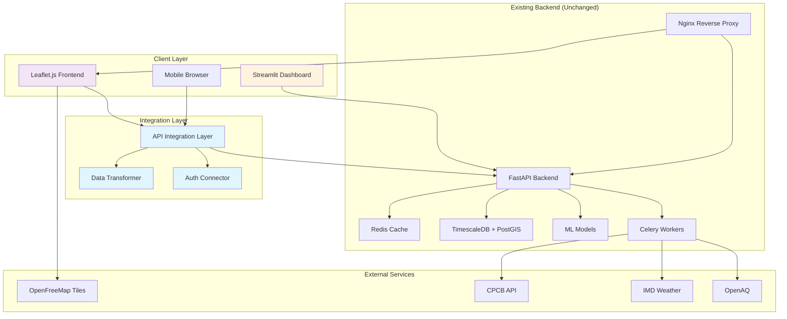
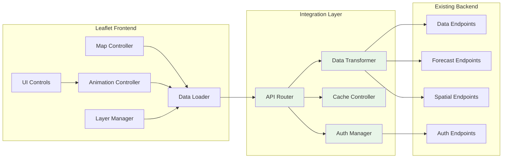

# Design Document

## Overview

This design document outlines the integration architecture for incorporating a Leaflet.js + OpenFreeMap frontend into the existing AQI Predictor system. The solution maintains backward compatibility with the current Streamlit dashboard while providing enhanced interactive mapping capabilities through a modern web interface.

The integration leverages the existing production-ready FastAPI backend, TimescaleDB database, ML models, and Docker infrastructure without requiring modifications to core backend functionality. A lightweight integration layer transforms existing API responses to support the Leaflet frontend's data requirements.

## Architecture

### High-Level Architecture



### Component Architecture



## Components and Interfaces

### 1. Leaflet Frontend Components

#### Map Controller (`map.js`)
- **Purpose**: Core map initialization and event handling
- **Responsibilities**:
  - Initialize Leaflet map with OpenFreeMap tiles
  - Manage map state (zoom, center, bounds)
  - Handle user interactions (click, zoom, pan)
  - Coordinate between different visualization modes
- **Interface**:
  ```javascript
  class MapController {
    initMap(config)
    switchView(viewType) // 'current' | 'forecast'
    switchVisualization(vizType) // 'markers' | 'heatmap'
    updateBounds(bounds)
    getCurrentView()
  }
  ```

#### Data Loader (`data-loader.js`)
- **Purpose**: API communication and data fetching
- **Responsibilities**:
  - Fetch data from Integration Layer endpoints
  - Handle authentication tokens
  - Implement caching and retry logic
  - Transform API responses for frontend consumption
- **Interface**:
  ```javascript
  class DataLoader {
    fetchCurrentAQI(filters)
    fetchForecast(location, hours)
    fetchSpatialData(bounds, resolution)
    fetchStations(filters)
    authenticate(credentials)
    refreshToken()
  }
  ```

#### Layer Manager (`layers.js`)
- **Purpose**: Map layer creation and management
- **Responsibilities**:
  - Create and update marker clusters
  - Generate heatmap layers
  - Manage layer visibility and styling
  - Handle popup content generation
- **Interface**:
  ```javascript
  class LayerManager {
    createMarkerLayer(data)
    createHeatmapLayer(data)
    updateLayer(layer, newData)
    createPopupContent(stationData)
    applyFilters(layer, filters)
  }
  ```

#### Animation Controller (`animation.js`)
- **Purpose**: Forecast animation and timeline control
- **Responsibilities**:
  - Manage 24-hour forecast animation
  - Handle play/pause/scrub controls
  - Preload animation frames
  - Smooth transitions between time steps
- **Interface**:
  ```javascript
  class AnimationController {
    startAnimation()
    pauseAnimation()
    resetAnimation()
    setHour(hour)
    preloadFrames(hours)
  }
  ```

### 2. Integration Layer Components

#### API Router (`api-router.js`)
- **Purpose**: Route frontend requests to appropriate backend endpoints
- **Responsibilities**:
  - Map frontend data requests to existing API endpoints
  - Handle request/response transformation
  - Implement error handling and retries
  - Manage API versioning
- **Interface**:
  ```javascript
  class APIRouter {
    route(request)
    mapEndpoint(frontendRequest)
    handleError(error)
    validateResponse(response)
  }
  ```

#### Data Transformer (`data-transformer.js`)
- **Purpose**: Transform backend responses to frontend-compatible formats
- **Responsibilities**:
  - Convert measurement data to GeoJSON
  - Transform coordinate systems
  - Aggregate and format time series data
  - Calculate derived values (AQI categories, colors)
- **Interface**:
  ```javascript
  class DataTransformer {
    toGeoJSON(measurements)
    transformSpatialData(gridData)
    formatForecast(forecastData)
    calculateAQIMetrics(pollutantData)
  }
  ```

#### Cache Controller (`cache-controller.js`)
- **Purpose**: Client-side caching and performance optimization
- **Responsibilities**:
  - Implement browser-based caching
  - Manage cache expiration
  - Handle offline scenarios
  - Optimize data loading patterns
- **Interface**:
  ```javascript
  class CacheController {
    get(key)
    set(key, data, ttl)
    invalidate(pattern)
    isStale(key)
    getOfflineData()
  }
  ```

### 3. Backend Integration Points

#### Existing Endpoints Mapping

| Frontend Need | Existing Endpoint | Transformation Required |
|---------------|-------------------|------------------------|
| Current AQI Data | `/api/v1/data/air-quality/latest` | Add GeoJSON formatting |
| Monitoring Stations | `/api/v1/data/stations` | Convert to GeoJSON features |
| 24h Forecast | `/api/v1/forecast/24h/{location}` | Format for animation timeline |
| Spatial Grid | `/api/v1/forecast/spatial` | Convert to heatmap data |
| Weather Data | `/api/v1/data/weather/latest` | Integrate with AQI data |
| Authentication | `/api/v1/auth/*` | JWT token management |

#### New Integration Endpoints

```javascript
// Integration layer endpoints (served alongside existing API)
GET /api/v1/integration/geojson/current
GET /api/v1/integration/geojson/stations
GET /api/v1/integration/geojson/forecast/{location}
GET /api/v1/integration/heatmap/spatial
GET /api/v1/integration/config/frontend
```

## Data Models

### Frontend Data Structures

#### GeoJSON Station Feature
```javascript
{
  "type": "Feature",
  "geometry": {
    "type": "Point",
    "coordinates": [longitude, latitude]
  },
  "properties": {
    "station_id": "DEL001",
    "station_name": "Anand Vihar",
    "district": "East Delhi",
    "aqi": 285,
    "category": "Very Unhealthy",
    "color": "#8F3F97",
    "pollutants": {
      "pm25": {"value": 165.5, "unit": "μg/m³", "aqi": 285},
      "pm10": {"value": 280.3, "unit": "μg/m³", "aqi": 245},
      "no2": {"value": 45.2, "unit": "μg/m³", "aqi": 42}
    },
    "weather": {
      "temperature": 28.5,
      "humidity": 65,
      "wind_speed": 3.2
    },
    "source_attribution": {
      "vehicular": 45,
      "industrial": 20,
      "biomass": 25,
      "background": 10
    },
    "forecast": {
      "1h": 290,
      "6h": 275,
      "24h": 260
    },
    "timestamp": "2024-01-15T10:30:00Z"
  }
}
```

#### Heatmap Data Structure
```javascript
{
  "type": "FeatureCollection",
  "features": [
    {
      "type": "Feature",
      "geometry": {
        "type": "Point",
        "coordinates": [longitude, latitude]
      },
      "properties": {
        "aqi": 285,
        "intensity": 0.85, // Normalized 0-1 for heatmap
        "category": "Very Unhealthy",
        "confidence": 0.8
      }
    }
  ],
  "metadata": {
    "bounds": {
      "north": 28.9,
      "south": 28.4,
      "east": 77.6,
      "west": 76.8
    },
    "resolution_km": 1.0,
    "generated_at": "2024-01-15T10:30:00Z"
  }
}
```

#### Animation Frame Data
```javascript
{
  "hour": 6,
  "timestamp": "2024-01-15T16:30:00Z",
  "stations": [
    {
      "station_id": "DEL001",
      "coordinates": [77.2090, 28.6139],
      "aqi": 295,
      "category": "Hazardous",
      "color": "#7E0023",
      "confidence": {
        "lower": 275,
        "upper": 315,
        "level": "high"
      }
    }
  ]
}
```

### Backend Data Transformation

#### Current API Response → GeoJSON Transformation
```python
# Existing response from /api/v1/data/air-quality/latest
{
  "measurements": [
    {
      "time": "2024-01-15T10:30:00Z",
      "station_id": "DEL001",
      "parameter": "pm25",
      "value": 165.5,
      "unit": "μg/m³",
      "location": {"coordinates": [77.2090, 28.6139]}
    }
  ]
}

# Transformed to GeoJSON for frontend
{
  "type": "FeatureCollection",
  "features": [
    {
      "type": "Feature",
      "geometry": {
        "type": "Point", 
        "coordinates": [77.2090, 28.6139]
      },
      "properties": {
        "station_id": "DEL001",
        "aqi": 285,
        "pollutants": {"pm25": {"value": 165.5, "unit": "μg/m³"}}
      }
    }
  ]
}
```

## Error Handling

### Frontend Error Handling Strategy

#### Network Error Handling
```javascript
class ErrorHandler {
  handleNetworkError(error) {
    // Show cached data if available
    // Display offline indicator
    // Retry with exponential backoff
  }
  
  handleAPIError(response) {
    // Parse error response
    // Show user-friendly message
    // Log for debugging
  }
  
  handleDataError(data) {
    // Validate data structure
    // Handle missing fields gracefully
    // Show partial data with warnings
  }
}
```

#### Graceful Degradation
- **No Network**: Show cached data with staleness indicator
- **Partial Data**: Display available information, mark missing data
- **API Errors**: Fall back to sample data for demonstration
- **Authentication Failure**: Redirect to login, preserve state

### Backend Error Handling

#### Integration Layer Error Responses
```javascript
{
  "error": {
    "code": "TRANSFORMATION_ERROR",
    "message": "Failed to convert data to GeoJSON format",
    "details": "Invalid coordinate data in station DEL001",
    "timestamp": "2024-01-15T10:30:00Z",
    "request_id": "req_123456"
  },
  "fallback_data": {
    // Cached or sample data when available
  }
}
```

## Testing Strategy

### Unit Testing

#### Frontend Unit Tests
- **Map Controller**: Test map initialization, view switching, event handling
- **Data Loader**: Test API calls, authentication, error handling
- **Layer Manager**: Test layer creation, updates, filtering
- **Animation Controller**: Test timeline controls, frame transitions

#### Integration Layer Unit Tests  
- **Data Transformer**: Test GeoJSON conversion, coordinate transformation
- **API Router**: Test endpoint mapping, request routing
- **Cache Controller**: Test caching logic, expiration handling

### Integration Testing

#### Frontend-Backend Integration
- **API Connectivity**: Test all endpoint mappings work correctly
- **Data Flow**: Verify data transforms properly through the pipeline
- **Authentication**: Test JWT token handling and refresh
- **Error Scenarios**: Test network failures, invalid responses

#### Cross-Browser Testing
- **Desktop Browsers**: Chrome, Firefox, Safari, Edge
- **Mobile Browsers**: iOS Safari, Android Chrome
- **Performance**: Test on various device capabilities

### Property-Based Testing

Property tests will be implemented to validate the correctness of data transformations and API integrations. These tests will be added after the prework analysis phase.

## Deployment Strategy

### Development Environment

#### Local Development Setup
```bash
# Start existing backend services
docker-compose -f docker-compose.dev.yml up -d

# Serve Leaflet frontend
cd frontend
python -m http.server 8080

# Frontend accessible at http://localhost:8080
# Backend API at http://localhost:8000
```

#### Development Configuration
```javascript
// config/development.js
export const config = {
  API_BASE_URL: 'http://localhost:8000/api/v1',
  INTEGRATION_BASE_URL: 'http://localhost:8000/api/v1/integration',
  MAP_CENTER: [28.6139, 77.2090],
  MAP_ZOOM: 10,
  CACHE_TTL: 300, // 5 minutes
  ANIMATION_SPEED: 1500 // ms per frame
};
```

### Production Deployment

#### Nginx Configuration Update
```nginx
# Add to existing nginx.conf
location /map {
    alias /app/frontend;
    try_files $uri $uri/ /index.html;
    
    # Cache static assets
    location ~* \.(js|css|png|jpg|jpeg|gif|ico|svg)$ {
        expires 1y;
        add_header Cache-Control "public, immutable";
    }
}

location /api/v1/integration {
    proxy_pass http://api:8000;
    proxy_set_header Host $host;
    proxy_set_header X-Real-IP $remote_addr;
}
```

#### Docker Integration
```dockerfile
# Add to existing Dockerfile
FROM node:18-alpine AS frontend-builder
WORKDIR /app/frontend
COPY frontend/ .
RUN npm install && npm run build

FROM nginx:alpine
COPY --from=frontend-builder /app/frontend/dist /usr/share/nginx/html/map
COPY docker/nginx.conf /etc/nginx/nginx.conf
```

#### Production Configuration
```javascript
// config/production.js
export const config = {
  API_BASE_URL: '/api/v1',
  INTEGRATION_BASE_URL: '/api/v1/integration',
  MAP_CENTER: [28.6139, 77.2090],
  MAP_ZOOM: 10,
  CACHE_TTL: 900, // 15 minutes
  ANIMATION_SPEED: 1000 // ms per frame
};
```

### Monitoring and Observability

#### Frontend Monitoring
- **Performance Metrics**: Page load time, API response time, map render time
- **Error Tracking**: JavaScript errors, API failures, network issues
- **User Analytics**: Feature usage, device types, geographic distribution

#### Integration Layer Monitoring
- **API Metrics**: Request volume, response times, error rates
- **Cache Performance**: Hit rates, memory usage, eviction patterns
- **Data Quality**: Transformation success rates, validation failures

The monitoring will integrate with existing Prometheus/Grafana infrastructure to provide unified observability across the entire system.

## Correctness Properties

*A property is a characteristic or behavior that should hold true across all valid executions of a system—essentially, a formal statement about what the system should do. Properties serve as the bridge between human-readable specifications and machine-verifiable correctness guarantees.*

### Property 1: API Routing Consistency
*For any* valid frontend data request (current AQI, forecast, spatial, or station data), the Integration Layer should correctly route the request to the corresponding existing backend endpoint and return a successful response.
**Validates: Requirements 1.1, 1.2, 1.3, 1.4**

### Property 2: Data Transformation Preservation  
*For any* valid backend API response containing measurement or spatial data, the Integration Layer should transform it to valid GeoJSON format while preserving all original data fields and adding proper geographic formatting.
**Validates: Requirements 1.5, 2.1, 2.2, 2.3, 2.4**

### Property 3: Authentication Integration
*For any* request requiring authentication, the Leaflet Frontend should use existing JWT tokens from the Backend API, include proper authorization headers, and handle token refresh correctly when tokens expire.
**Validates: Requirements 1.6, 7.1, 7.2, 7.3**

### Property 4: Performance Requirements
*For any* initial map load on 3G connections, the Leaflet Frontend should display the basic map within 3 seconds and fetch latest measurements from the Backend API within 5 seconds.
**Validates: Requirements 3.1, 9.1**

### Property 5: Real-Time Data Updates
*For any* running map instance, the Leaflet Frontend should automatically update visualizations every 15 minutes when new data becomes available and cache data locally to reduce API calls.
**Validates: Requirements 3.2, 3.4**

### Property 6: Offline Graceful Degradation
*For any* network connectivity loss scenario, the Leaflet Frontend should display cached data with appropriate staleness indicators and handle the offline state gracefully.
**Validates: Requirements 3.5**

### Property 7: Animation Smoothness
*For any* forecast animation playback, the Leaflet Frontend should smoothly transition between hourly predictions and preload next frames to ensure uninterrupted playback.
**Validates: Requirements 3.3, 9.3**

### Property 8: Visualization Mode Switching
*For any* visualization mode change (markers to heatmap or current to forecast), the Leaflet Frontend should correctly render the new visualization with proper data display and interactive functionality.
**Validates: Requirements 4.1, 4.2, 4.4**

### Property 9: Interactive Feature Completeness
*For any* station marker click interaction, the Leaflet Frontend should display a detailed popup containing all required information (pollutant levels, weather, and source attribution).
**Validates: Requirements 4.3**

### Property 10: Filtering Functionality
*For any* district-based filter selection, the Leaflet Frontend should correctly filter displayed data using existing city/state data from the Backend API.
**Validates: Requirements 4.5**

### Property 11: Mobile Responsiveness
*For any* screen size below 768px, the Leaflet Frontend should adapt control panels to touch-friendly layouts, reorganize UI elements to prevent overlap, and optimize marker clustering for mobile viewport sizes.
**Validates: Requirements 5.1, 5.2, 5.4**

### Property 12: Touch Interaction Support
*For any* touch gesture input on mobile devices, the Leaflet Frontend should support pinch-to-zoom and pan navigation correctly.
**Validates: Requirements 5.3**

### Property 13: Data Usage Optimization
*For any* mobile usage scenario, the Leaflet Frontend should minimize data usage through efficient caching and progressive loading strategies.
**Validates: Requirements 5.5**

### Property 14: Rate Limiting Compliance
*For any* API request pattern, the Leaflet Frontend should respect existing rate limiting configured in Backend API middleware and not exceed the allowed request rates.
**Validates: Requirements 7.4**

### Property 15: CORS Handling
*For any* cross-origin request between frontend and backend, the Integration Layer should handle CORS configuration correctly to allow proper communication.
**Validates: Requirements 7.5**

### Property 16: Backward Compatibility Preservation
*For any* existing Streamlit Dashboard functionality, the system should maintain full functionality and existing endpoint contracts when the Leaflet frontend is deployed alongside it.
**Validates: Requirements 8.1, 8.2**

### Property 17: Dual Frontend Performance
*For any* concurrent usage of both Streamlit and Leaflet frontends, the Backend API should continue serving both interfaces efficiently with acceptable response times.
**Validates: Requirements 8.3**

### Property 18: Caching Integration
*For any* spatial data request, the Integration Layer should implement efficient caching using existing Redis infrastructure and include appropriate cache headers and compression in API responses.
**Validates: Requirements 9.2, 9.5**

### Property 19: Marker Clustering Efficiency
*For any* large number of monitoring stations, the Leaflet Frontend should use marker clustering to handle the display efficiently without performance degradation.
**Validates: Requirements 9.4**

### Property 20: Configuration Consistency
*For any* deployment environment (development, staging, production), the Leaflet Frontend should read API endpoints from environment variables and use the same configuration approach as the existing Backend API.
**Validates: Requirements 10.1, 10.2, 10.3**

### Property 21: Environment Configuration Validation
*For any* deployment process, the Deployment Pipeline should validate configuration consistency between frontend and backend components and support all required environment configurations.
**Validates: Requirements 10.4, 10.5**